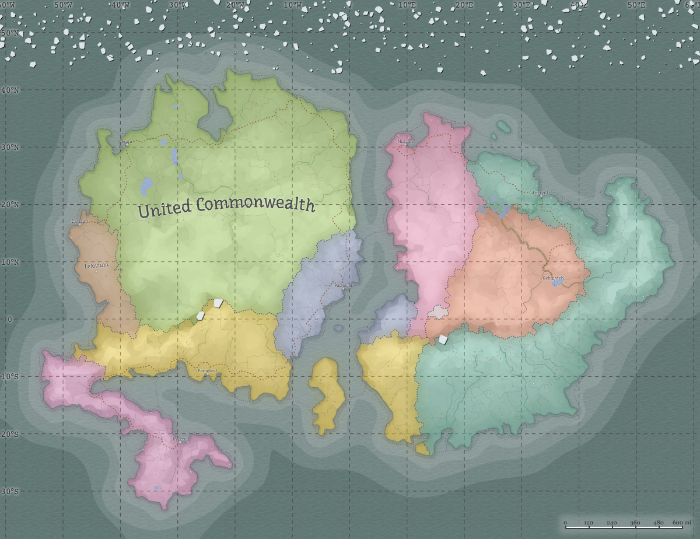

# Terra

Caseyverse takes place on a continental planet named Terra with the majority of the stories taking places in the United Commonwealth.

## United Commonwealth

Modeled after the US and UK, the United Commonwealth (UC) is a democratic nation with a parliamentary government. After helping win the Great War, it became the largest and most powerful nation in Terra. The UC has a 90% prey and 10% predator population but the latter started to gain more control that the former issued a nationwide tame collar law.

## Technology

The world of Terra mixes late 20th and early 21st century technologies, such as cassettes and the 3½-inch floppy disks along with smartphones and virtual reality headsets, respectfully.

## Note

For all practical purposes, the the grander world isn’t necessarily all that important for the majority of stories with certain exceptions, such as maps, national issues, or anything astronautical-related. The majority of stories take place in Furtropolis and surrounding areas within New Hazelport, such as the Hundred Acre Wood, even when national are addressed.